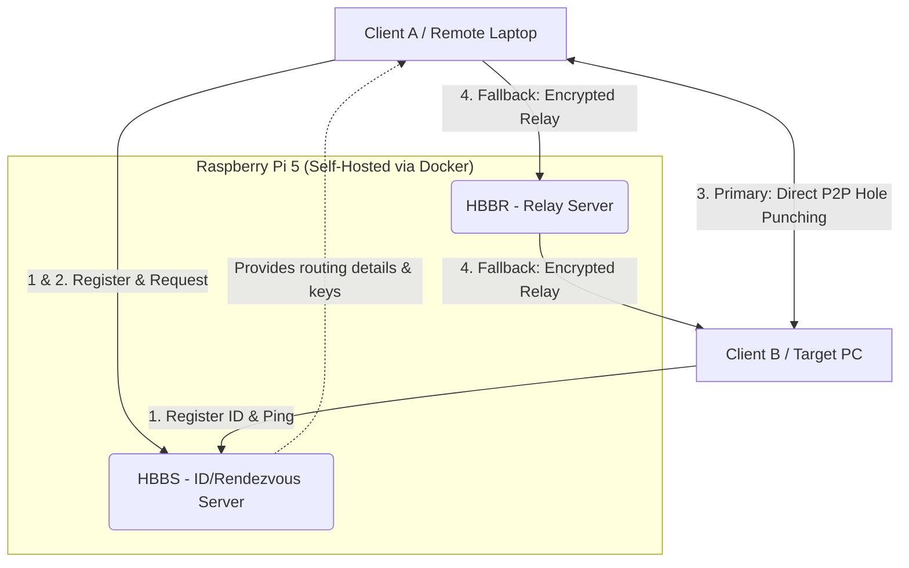

RustDesk is a free and open-source remote desktop application that allows you to control computers remotely. It serves as an excellent alternative to commercial tools like TeamViewer or AnyDesk, but its true superpower lies in its architecture: you can self-host the server infrastructure yourself.

---

## Project Overview

### 1. What problem did I solve with this project?

In this project, I try to solve the growing challenge of secure, self-managed remote computer access without relying on third-party commercial servers. Commercial tools often suffer from restrictive time limits, false-positive "commercial use" flags, and routing your private desktop data through unknown third-party servers. 

By hosting my own RustDesk infrastructure on a low-power Raspberry Pi 5, I achieved not only complete data sovereignty and total administrative control over my remote connections, but also a highly reliable, low-latency solution that operates entirely on my own hardware. This means no surprise paywalls, no data throttling, and absolute privacy for my remote sessions.

### 2. Technical Architecture & How it Works

The RustDesk self-hosted environment relies on two distinct server components—HBBS and HBBR—that work together to facilitate connections between devices. 

*   HBBS (RustDesk ID/Rendezvous Server): This is the "matchmaking" signaling server. It manages client IDs, heartbeats, and NAT traversal tests. Its primary goal is to help two devices find each other and establish a direct, peer-to-peer (P2P) connection using a technique called "hole punching".
*   HBBR (RustDesk Relay Server): This is the data relay server. It acts as a fallback intermediary. If a direct P2P connection fails (usually because both devices are behind strict corporate firewalls or symmetric NATs), the encrypted video and control traffic is safely routed through HBBR to ensure the connection still succeeds.

#### The Connection Flow

1. Registration: Every time a RustDesk client opens, it "pings" the HBBS server to announce its current IP and claim its numerical ID.
2. Request: When Client A wants to control Client B, it asks the HBBS server for Client B's connection details.
3. Hole Punching (P2P): HBBS attempts to connect Client A and Client B directly to each other. If successful, data flows peer-to-peer, bypassing the server entirely for maximum speed.
4. Fallback Relay: If "hole punching" fails due to strict firewalls, both clients connect to HBBR, which acts as a secure middleman relaying the screen data.



### 3. Tech Stack & Development Process

Tech Stack:
*   Hardware: Raspberry Pi 5 (ARM architecture)
*   Core Software: RustDesk Client & Server, Docker, Docker Compose
*   Operating Systems: Linux (Raspberry Pi OS / Debian), macOS

How I developed it:

I began by preparing the Raspberry Pi 5 as the headless server. Because standard package managers often lack the latest Docker binaries for ARM architectures, I manually added Docker's official GPG keys and installed the Docker Engine directly from their repositories. 

Next, I wrote a `compose.yaml` file to deploy the HBBS and HBBR services. A critical architectural decision here was using `network_mode: "host"`. Running the containers in host mode ensures that Docker doesn't mask the true IP addresses and ports with its internal NAT network. This is absolutely essential for RustDesk's "hole punching" to work accurately and facilitate direct P2P connections.

After spinning up the server stack, I navigated to the generated data directory to retrieve the `id_ed25529.pub` public cryptographic key. This key is the foundation of the server's security—it ensures that only clients who possess the key can utilize my private relay server, preventing rogue clients from hijacking my bandwidth. Finally, I configured my desktop and laptop clients to point to the Pi's external IP address and injected the public key, fully locking down my personal remote desktop ecosystem.

---

## Part 1: Installing the RustDesk Client

Before pointing traffic to our own server, we need the RustDesk application installed on our end-user devices.

### Installing on Raspberry Pi 5 (Linux)

1. Check your architecture
Open your terminal and run:
```bash
uname -m
```
*The output for a Raspberry Pi 5 should be `aarch64`.*

2. Download RustDesk
You can download it from the [official releases page](https://rustdesk.com/download) or directly via the terminal:
```bash
wget https://github.com/rustdesk/rustdesk/releases/download/1.4.8/rustdesk-1.4.8-aarch64.deb
```

3. Install and Run
```bash
sudo apt install -fy ./rustdesk-1.4.8-aarch64.deb
rustdesk
```

### Installing on MacBook (macOS)

1. Check your architecture
```bash
uname -a
```

2. Install RustDesk via Homebrew
We use `--cask` because RustDesk is a GUI application:
```bash
brew install --cask rustdesk
```

3. Run the App
```bash
open -a rustdesk    
```
*(Tip: You can use a service like Proton Mail to create a secure account if needed).*

---

## Part 2: Self-Hosting RustDesk with Docker

### Requirements: Firewall Ports
To allow devices to reach your Raspberry Pi, be sure to open these specific ports in your router's firewall/port-forwarding settings:

HBBS (ID Server):
*   `21114 (TCP)`: Used for the web console (Pro version only).
*   `21115 (TCP)`: Used for the NAT type test.
*   `21116 (TCP/UDP)`: Used for ID registration, heartbeat service, TCP hole punching, and connection service. *(Must be enabled for both TCP and UDP).*
*   `21118 (TCP)`: Used to support web clients.

HBBR (Relay Server):
*   `21117 (TCP)`: Used for Relay services.
*   `21119 (TCP)`: Used to support web clients.

### Installing Docker on Raspberry Pi 5

Using standard `apt install docker` often fails or installs outdated versions on the Pi. Instead, install the latest version from Docker's official repository:

```bash
# Update and install prerequisites
sudo apt update
sudo apt install -y ca-certificates curl gnupg

# Add Docker's official GPG key
sudo install -m 0755 -d /etc/apt/keyrings
curl -fsSL https://download.docker.com/linux/debian/gpg | sudo gpg --dearmor -o /etc/apt/keyrings/docker.gpg
sudo chmod a+r /etc/apt/keyrings/docker.gpg

# Set up the repository
echo \
  "deb [arch=$(dpkg --print-architecture) signed-by=/etc/apt/keyrings/docker.gpg] \
  https://download.docker.com/linux/debian \
  $(. /etc/os-release && echo "$VERSION_CODENAME") stable" | \
  sudo tee /etc/apt/sources.list.d/docker.list > /dev/null

# Install Docker Engine and Compose
sudo apt update
sudo apt install -y docker-ce docker-ce-cli containerd.io docker-buildx-plugin docker-compose-plugin    
```

Verify the installation:
```bash
docker --version
docker compose version
```

### Deploying the Server

Now that Docker is installed, we can create the stack.

1. Create the Docker Compose file:
```bash
vim compose.yaml
```

2. Paste the configuration:
```yaml
services:
  hbbs:
    container_name: hbbs
    image: rustdesk/rustdesk-server:latest
    environment:
      - ALWAYS_USE_RELAY=Y
    command: hbbs
    volumes:
      - ./data:/root
    network_mode: "host"
    depends_on:
      - hbbr
    restart: unless-stopped
    
  hbbr:
    container_name: hbbr
    image: rustdesk/rustdesk-server:latest
    command: hbbr
    volumes:
      - ./data:/root
    network_mode: "host"
    restart: unless-stopped
```

3. Start the server:
Run the following command in detached mode (`-d`) to leave it running in the background:
```bash
sudo docker compose up -d
```

---

## Part 3: Configuring the Client

With the server running smoothly in the background, we need to point our RustDesk clients to it.

1. Get your Public Key
Go to the `data` directory created by Docker in the same folder as your `compose.yaml`:
```bash
cd data
cat id_ed25529.pub
```
This file stores your auto-generated cryptographic public key. You must paste this key into any device that wants to connect to your server. Without it, the server will reject the connection.

2. Update Client Settings
1. Open the RustDesk app on your device.
2. Navigate to Settings -> Network.
3. Select ID/Relay Server.


*   ID Server & Relay Server: Enter the External IP address of your Raspberry Pi 5. (This is the public IP address you see when you check a site like "What is my IP" from your home network). Both fields should have this exact IP.
*   Key: Paste the full text contents of your `id_ed25529.pub` file here.
*   Click OK.

*(You must apply these settings to both the controlling device and the target device).*

### Setting a Permanent Password

For unattended remote access (meaning nobody is sitting at the host computer to accept the connection), it's highly recommended to set a permanent password. This saves you from having to check the dynamically changing one-time password.

Go to: Settings -> Security -> Use permanent password -> Set permanent password.

That's it! You can now make private, secure RustDesk connections over your LAN or WAN using your very own Raspberry Pi 5 server.
